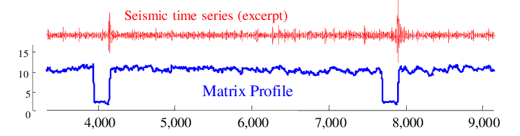

# Matrix Profile Library
A Java library for Matrix Profile

[](https://maven-badges.herokuapp.com/maven-central/io.github.ensozos/matrix-profile)


Overview
-------------------------
<p align="center">
   
</p>

The Matrix Profile, has the potential to revolutionize time series data mining because 
of its generality, versatility, simplicity and scalability.  In particular it has implications 
for time series motif discovery, time series joins, shapelet discovery (classification),
density estimation, semantic segmentation, visualization, rule discovery, clustering etc 

The advantages of using the Matrix Profile (over hashing, indexing, brute forcing a dimensionality reduced representation etc.) for most time series data mining tasks include:

- It is **exac**t: For motif discovery, discord discovery, time series joins etc., the Matrix Profile based methods provide no false positives or false dismissals.
- It is **simple and parameter-free**: In contrast, the more general spatial access method algorithms typically require building and tuning spatial access methods and/or hash function.
- It is **space efficien**t: Matrix Profile construction algorithms requires an inconsequential space overhead, just linear in the time series length with a small constant factor, allowing massive datasets to be processed in main memory.
- It allows **anytime algorithms**: While our exact algorithms are extremely scalable, for extremely large datasets we can compute the Matrix Profile in an anytime fashion, allowing ultra-fast approximate solutions.
- It is incrementally **maintainable**: Having computed the Matrix Profile for a dataset, we can incrementally update it very efficiently. In many domains this means we can effectively maintain exact joins/motifs/discords on streaming data forever.
- It does **not require the user to set similarity/distance thresholds**: For time series joins, the Matrix Profile provides full joins, eliminating the need to specify a similarity threshold, which is an unintuitive task for time series.
- It can **leverage hardware**: Matrix Profile construction is embarrassingly parallelizable, both on multicore processors and in distributed systems.
- It has **time complexity that is constant in subsequence length**: This is a very unusual and desirable property; all known time series join/motif/discord algorithms scale poorly as the subsequence length grows. In contrast, we have shown time series joins/motifs with subsequences lengths up to 100,000, at least two orders of magnitude longer than any other work we are aware of.
- It can be **constructed in deterministic time**: All join/motif/discord algorithms we are aware of can radically different times to finish on two (even slightly) different datasets. In contrast, given only the length of the time series, we can precisely predict in advance how long it will take to compute the Matrix Profile
- It can handle **missing data**: Even in the presence of missing data, we can provide answers which are guaranteed to have no false negatives.

For more information about matrix profile check out [The UCR Matrix Profile Page](http://www.cs.ucr.edu/~eamonn/MatrixProfile.html)

In version 0.0.2 we implemented MPdist measure. The useful properties of the MPdist include:
- Ability to compare time series of different lengths.
- Robust to spikes, dropouts, wandering baseline, missing values, and other issues that are common 
outside of benchmark dataset.
- Invariance to amplitude and offset offered by DTW and Euclidean distance as well as additional invariances, 
including phase invariance, order invariance, liner trend invariance, and stutter invariance.
- Allows scalability

We followed the fast MPdist algorithm that can be found in section
"Speeding up MPdist Search" in the official paper.

Usage
-------------------------
- MPdist (query by content)
- STMP (two time series)
- STMP (self join)
- STAMP (with two time series)
- STAMP (self join)
- Misc:
    * MASS v2.0
    * Fast moving SD
    * Fast moving average
        
Note: We are using ND4j as time series representation. You can find more information about ND4j [here](https://deeplearning4j.org/docs/latest/nd4j-overview)  

Installation
-------------------------
You can pull Matrix Profile library from the central maven repository, just add to **pom.xml** file:
```xml
<dependency>
   <groupId>io.github.ensozos</groupId>
   <artifactId>matrix-profile</artifactId>
   <version>0.0.3</version>
</dependency>
```

For gradle users add this to **build.gradle**:

```xml
compile 'io.github.ensozos:matrix-profile:0.0.3'
```

Example
--------------------------
The user needs to create a MatrixProfile profile object and pass the time series (INDArrays) as parameters:

```Java
  MatrixProfile matrixProfile = new MatrixProfile();
  
  int window = 4;
  INDArray target = Nd4j.create(new double[]{0.0, 6.0, -1.0, 2.0, 3.0, 1.0, 4.0}, new int[]{1, 7});
  INDArray query = Nd4j.create(new double[]{1.0, 2.0, 0.0, 0.0, -1}, new int[]{1, 5});

  matrixProfile.stamp(target, query, window);
```

For Matrix Profile distance you need to create MPdistance object:

```Java
  MPdistance mpDist = new MPdistance();
  
  int window = ...;
  INDArray target = Nd4j.create(...);
  INDArray query = Nd4j.create(...);

  mpDist.getMPdistance(target, query, window);
```

## Other projects with Matrix Profile

  - R: <https://github.com/franzbischoff/tsmp>
  - Python: <https://github.com/ZiyaoWei/pyMatrixProfile>
  - Python: <https://github.com/jbeleno/owlpy>
  - Python: <https://github.com/javidlakha/matrix-profile>
  - CUDA: <https://github.com/zpzim/SCAMP>

License
--------------------------
Distributed under the MIT license. See LICENSE for more information.


Paper Citation
-------------------------

- Yeh, Chin-Chia Michael & Zhu, Yan & Ulanova, Liudmila & Begum, Nurjahan & Ding, Yifei & Dau, Anh & Silva, Diego & Mueen, Abdullah & Keogh, Eamonn. (2016). Matrix Profile I: All Pairs Similarity Joins for Time Series: A Unifying View That Includes Motifs, Discords and Shapelets. 1317-1322. 10.1109/ICDM.2016.0179. 

- Abdullah Mueen, Yan Zhu, Michael Yeh, Kaveh Kamgar, Krishnamurthy Viswanathan, Chetan Kumar Gupta and Eamonn Keogh (2015), The Fastest Similarity Search Algorithm for Time Series Subsequences under Euclidean Distance

- Matrix Profile XII: MPdist: A Novel Time Series Distance Measure to Allow Data Mining in More Challenging Scenarios. Shaghayegh Gharghabi, Shima Imani, Anthony Bagnall, Amirali Darvishzadeh, Eamonn Keogh. ICDM 2018.
